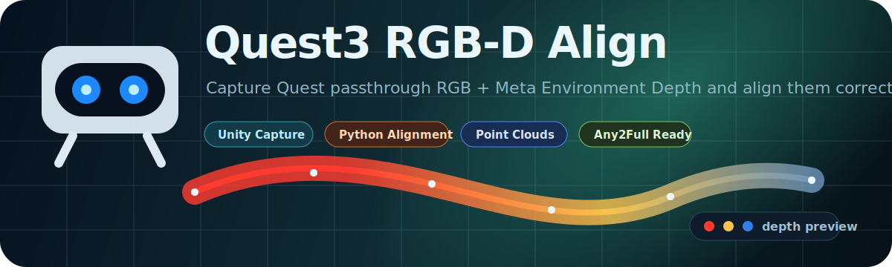
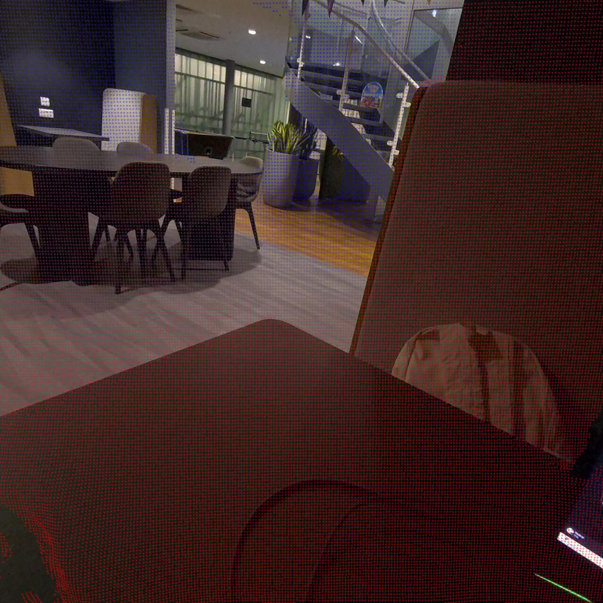
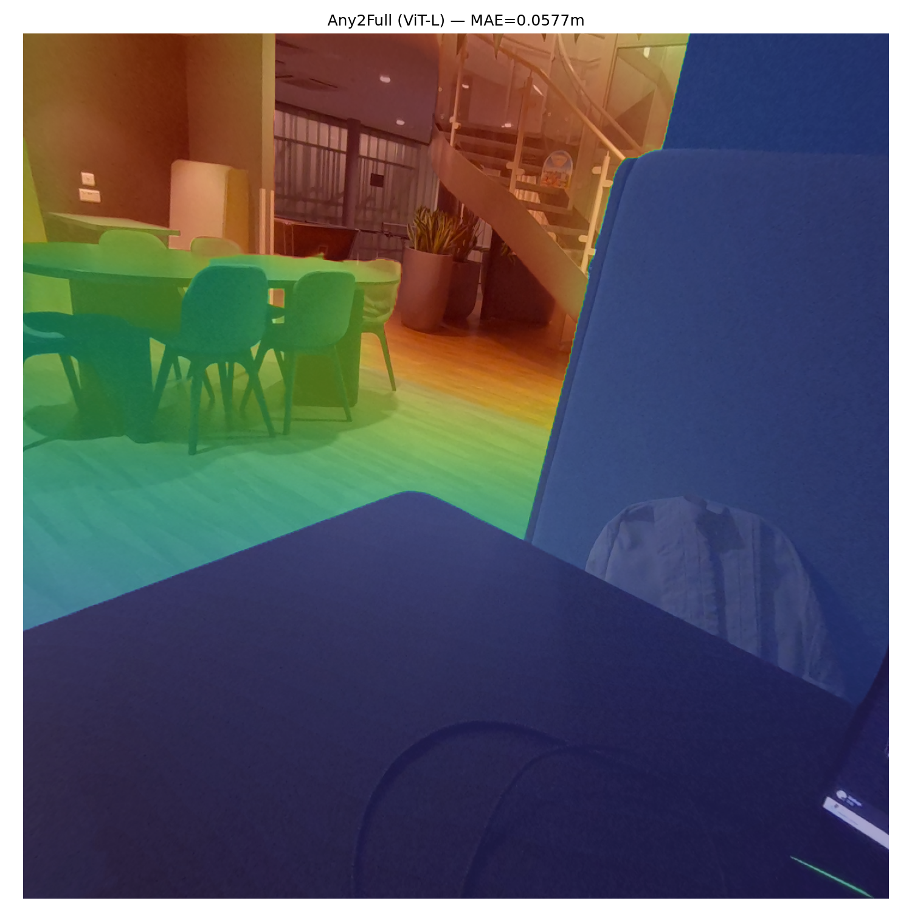
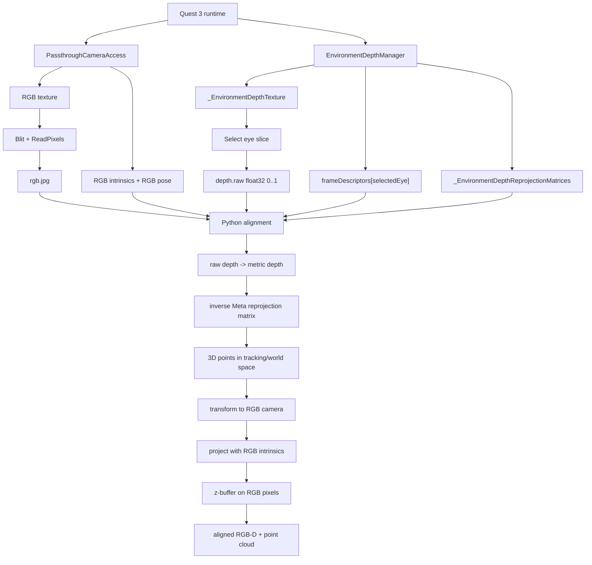

<p align="center">
  
</p>

<h1 align="center">Quest3 RGB-D Align</h1>

<p align="center">
  <a href="LICENSE"></a>
  
  
  
  
</p>

<p align="center">
  <strong>Capture Quest 3 passthrough RGB, align Meta Environment Depth correctly, and export RGB-D overlays plus RGB-colored point clouds.</strong>
</p>

---

This repository provides a minimal, reproducible RGB-D pipeline for Quest 3 / Quest 3S:

- Capture `rgb.jpg`, `depth.raw`, and `meta.json` inside Unity.
- Convert Meta Environment Depth raw texture values into metric depth.
- Reproject depth into the RGB camera using Meta SDK reprojection matrices.
- Export aligned RGB-D, visualization overlays, and RGB-colored point clouds.
- Optionally call an external Any2Full installation for dense depth completion.

> [!IMPORTANT]
> This is **not** a traditional `depth intrinsics + depth-to-rgb extrinsics` pipeline. Quest 3 Environment Depth must be aligned through Meta's Environment Depth reprojection matrix.

> [!NOTE]
> This repository is **source-available, not OSI open source**. Non-commercial use, forking, and modification are allowed with attribution. Commercial use requires prior permission from the licensor. See [LICENSE](LICENSE) and [NOTICE](NOTICE).

## Results Preview

<table>
  <tr>
    <td width="50%">
      
    </td>
    <td width="50%">
      
    </td>
  </tr>
  <tr>
    <td align="center"><strong>Sparse RGB-D alignment</strong><br>Projected Quest 3 depth samples over RGB. Red means near, blue means far.</td>
    <td align="center"><strong>Optional Any2Full completion</strong><br>Dense depth completion after the sparse alignment step. In this preview, blue means near and red means far.</td>
  </tr>
</table>

## Highlights

| Capability | What it does |
|---|---|
| Quest-native capture | Saves `rgb.jpg`, `depth.raw`, and `meta.json` directly from Unity on Quest 3 / Quest 3S. |
| SDK reprojection path | Uses Meta Environment Depth reprojection matrices instead of guessing depth-camera intrinsics. |
| RGB-D export | Produces aligned metric depth, overlay images, colormaps, and summary metadata. |
| Point cloud export | Generates RGB-camera-space `.npy` and RGB-colored `.ply` point clouds. |
| Optional dense completion | Can call an external Any2Full setup when `--complete-depth` is requested. |

## What You Get

```text
capture_0000/
  rgb.jpg                         # Quest passthrough RGB
  depth.raw                       # raw Environment Depth texture, float32, 0..1
  meta.json                       # camera poses, intrinsics, FOV, z-buffer, reprojection matrices
  aligned/
    aligned_depth_m.npy           # RGB-resolution metric depth, metres, 0 = no depth
    aligned_overlay.png           # visual RGB-D overlay
    aligned_depth_colormap.png    # depth colormap
    point_cloud_rgb_camera_m.npy  # RGB-camera-space point cloud
    point_cloud_rgb_camera.ply    # RGB-colored PLY point cloud
    summary.json
```

## Repository Layout

```text
unity/
  Quest3RgbdCaptureFinal.cs
  SmartRoomDepthArraySliceToFloat.shader

python/
  quest3_rgbd_align_final.py

docs/
  quest3_rgbd_alignment_pipeline.md

requirements.txt
```

## Requirements

Unity side:

- Quest 3 or Quest 3S.
- Unity project with Meta XR SDK / MR Utility Kit.
- `PassthroughCameraAccess`.
- `EnvironmentDepthManager`.
- Permissions for headset camera and environment depth / scene access.

Python side:

- Python 3.10+.
- `numpy`.
- `opencv-python`.

Install Python dependencies:

```powershell
pip install -r requirements.txt
```

## Unity Capture

Copy the Unity files into your Quest 3 Unity project:

```text
Assets/Scripts/Quest3RgbdCaptureFinal.cs
Assets/Resources/SmartRoomDepthArraySliceToFloat.shader
```

Add `Quest3RgbdCaptureFinal` to a GameObject. Assign references manually or let the script find:

- `PassthroughCameraAccess`
- `EnvironmentDepthManager`

Capture one frame:

```csharp
var capture = FindFirstObjectByType<Quest3RgbdCaptureFinal>();
capture.CaptureOnce("/storage/emulated/0/Android/data/<package>/files/rgbd_test/capture_0000");
```

The capture directory will contain:

```text
rgb.jpg
depth.raw
meta.json
```

`depth.raw` is **not metric depth**. It is the selected slice from `_EnvironmentDepthTexture`, stored as `float32` raw values in `0..1`. The Python script performs the metric conversion and reprojection.

## Python Alignment

Align one capture directory:

```powershell
python python/quest3_rgbd_align_final.py path\to\capture_0000 --output-dir path\to\capture_0000\aligned
```

Example:

```powershell
python python/quest3_rgbd_align_final.py E:\test\rgbd-v11\rgbd_test\capture_0000 --output-dir E:\test\rgbd-v11\rgbd_test\capture_0000\aligned
```

Programmatic use:

```python
from pathlib import Path
from quest3_rgbd_align_final import align_rgbd_capture

summary = align_rgbd_capture(
    Path("E:/test/rgbd-v11/rgbd_test/capture_0000"),
    output_dir=Path("E:/test/rgbd-v11/rgbd_test/capture_0000/aligned"),
)
print(summary)
```

## Output Files

| File | Description |
|---|---|
| `aligned_depth_m.npy` | RGB-resolution metric depth map. Unit: metres. `0` means no projected depth. |
| `aligned_overlay.png` | RGB image with projected depth points overlaid. Near is red, far is blue. |
| `aligned_depth_colormap.png` | Standalone sparse-alignment depth visualization. Invalid pixels are black. In the current viewer output, near is red and far is blue. |
| `point_cloud_rgb_camera_m.npy` | Point cloud in RGB camera coordinates. |
| `point_cloud_rgb_camera.ply` | RGB-colored point cloud for external viewers. |
| `summary.json` | Basic statistics and output metadata. |

Point cloud coordinate convention:

```text
x = RGB camera right
y = RGB camera up
z = RGB camera forward
unit = metres
origin = RGB camera
```

## Pipeline



Short version:

```text
Quest 3 Environment Depth raw texture
-> raw-to-metric depth conversion
-> inverse Meta Environment Depth reprojection matrix
-> tracking/world 3D points
-> RGB camera pose + intrinsics projection
-> z-buffer into RGB pixels
-> aligned RGB-D
```

See the full technical explanation in [docs/quest3_rgbd_alignment_pipeline.md](docs/quest3_rgbd_alignment_pipeline.md).

## Optional Any2Full Dense Completion

Any2Full is optional. It is **not** included in this repository, and default RGB-D alignment does not require it.

If you install Any2Full separately, you can request dense completion:

```powershell
python python/quest3_rgbd_align_final.py path\to\capture_0000 --complete-depth `
  --any2full-dir path\to\Any2Full `
  --any2full-venv-python path\to\Any2Full\.venv\Scripts\python.exe `
  --any2full-checkpoint path\to\Any2Full\checkpoints\Any2Full_vitl.pth.tar
```

Expected Any2Full entry point:

```text
<any2full-dir>/any2full_infer.py
```

Expected interface:

```text
any2full_infer.py --rgb <rgb.jpg> --depth <aligned_depth_m.npy> --out <dense_depth_any2full.npy> --checkpoint <ckpt> --encoder <vits|vitb|vitl>
```

If `--complete-depth` is used without configuration, the script prints setup instructions and exits.

## Known Limitations

- RGB capture currently uses `GetTexture() -> Blit -> ReadPixels`; fast head motion can introduce frame timing error.
- Environment Depth is low resolution compared with RGB, so aligned depth is naturally sparse.
- Transparent, reflective, thin, or low-texture objects may have unreliable depth.
- Edges can show disocclusion because RGB and Environment Depth are not the same physical sensor.
- Dense completion is optional and should be treated as inferred depth, not raw sensor measurement.

## License

This repository uses the `Quest3 RGB-D Align Source-Available License v1.0`.

- Non-commercial use, fork, modification, and redistribution are allowed.
- Attribution and preservation of `LICENSE` and `NOTICE` are required.
- Commercial use requires prior permission from the licensor.

See [LICENSE](LICENSE) and [NOTICE](NOTICE).
