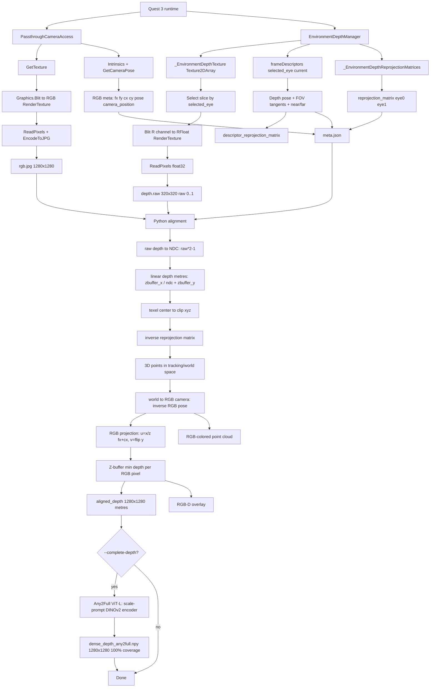

# Quest 3 RGB-D 对齐管线说明（v11）

本文档记录当前 Quest 3 RGB-D 采集与离线对齐管线。目标是说明：Unity/C# 端采集了什么数据，Python 端如何使用这些数据，经过哪些公式和坐标变换，最终如何得到 RGB 图上的 aligned depth 与 RGB-colored point cloud。

当前结论：v11 的 RGB-D overlay 已经基本正确。关键验证结果是：Unity 采集端保存的 `reprojection_matrix` 与按 depth descriptor 重建的 `descriptor_reprojection_matrix` 在 5 帧中完全一致，最大差值为 `0.0`；`tracking_space_world_to_local` 为 identity；RGB 相机侧别为 Left，depth selected eye 为 0。

---

## 1. 数据来源与文件结构

v11 数据目录：

```text
E:\test\rgbd-v11\rgbd_test\
  capture_0000\
    rgb.jpg
    depth.raw
    meta.json
  capture_0001\
  capture_0002\
  capture_0003\
  capture_0004\
  capture_log.txt
  saturation_test_log.txt
```

每帧包含三类核心数据：

| 文件 | 内容 |
|---|---|
| `rgb.jpg` | Passthrough Camera RGB 图，当前为 `1280 x 1280` |
| `depth.raw` | Meta Environment Depth texture 的 raw float32 数据，当前为 `320 x 320`，值域是 raw depth texture `0..1`，不是米制深度 |
| `meta.json` | RGB 内参/位姿、depth descriptor/FOV、zbuffer 参数、eye/slice 信息、SDK reprojection matrix |

v11 第 0 帧核心字段示例：

```text
rgb.camera_position = Left
rgb.selected_depth_eye = 0
rgb.resolution = 1280 x 1280
rgb.fx = 866.522
rgb.fy = 866.522
rgb.cx = 645.501
rgb.cy = 640.748

depth.selected_eye = 0
depth.texture_width = 320
depth.texture_height = 320
depth.texture_slices = 2
depth.texture_dimension = Tex2DArray
depth.depth_values = float32_raw_environment_depth_0_1
depth.fov_left = 1.3763818
depth.fov_right = 0.8390996
depth.fov_top = 0.9656888
depth.fov_bottom = 1.4281479
depth.near_z = 0.1
depth.far_z = Infinity
depth.zbuffer_x = -0.2
depth.zbuffer_y = -1.0
```

---

## 2. Unity/C# 采集端管线

采集脚本：

```text
D:\FromGithub\UCL\CASA0022\Smart Room\unity\Quest3Client\Assets\Scripts\DepthPoseSaturationTest.cs
```

当前采集端做了四件事：采 RGB、采 depth raw texture、采当前 depth descriptor pose/FOV、保存 SDK 使用的 reprojection matrix。

### 2.1 RGB 采集

函数：`TryCaptureRGB(...)`

当前 RGB 采集路径：

```text
PassthroughCameraAccess.GetTexture()
-> Graphics.Blit(source, _rgbRt)
-> Texture2D.ReadPixels(...)
-> EncodeToJPG(jpegQuality)
-> rgb.jpg
```

同时保存 RGB meta：

```text
_pca.Intrinsics.FocalLength
_pca.Intrinsics.PrincipalPoint
_pca.Intrinsics.SensorResolution
_pca.GetCameraPose()
_pca.CameraPosition
GetSelectedDepthEyeIndex()
```

RGB 投影后处理时使用的是这些字段：

```text
fx = rgb.focal_length_x
fy = rgb.focal_length_y
cx = rgb.principal_point_x
cy = rgb.principal_point_y
pose = rgb.pose_position + rgb.pose_rotation
resolution = rgb.resolution_w x rgb.resolution_h
```

注意：RGB 当前仍使用 `GetTexture() -> Blit -> ReadPixels()`。这一路径在快速头动时可能存在上一帧纹理风险；但 trigger 采集且头部基本静止时影响较小。

### 2.2 Depth raw texture 采集

函数：`TryCaptureDepthNDC(...)`

采集路径：

```text
Shader.GetGlobalTexture("_EnvironmentDepthTexture")
-> 确认是 Texture2DArray
-> _depthMaterial.SetTexture("_SourceDepthArray", sourceDepth)
-> _depthMaterial.SetFloat("_ArraySlice", selectedEye)
-> Graphics.Blit(null, _depthRt, _depthMaterial)
-> Texture2D.ReadPixels(...)
-> GetRawTextureData<float>()
-> depth.raw
```

depth shader 只做一件事：读取 texture array 指定 slice 的 `.r` 值，原样写入 RFloat render texture。

```hlsl
float3 uv = float3(i.uv, _ArraySlice);
float depthValue = UNITY_SAMPLE_TEX2DARRAY(_SourceDepthArray, uv).r;
return float4(depthValue, 0.0, 0.0, 1.0);
```

因此 `depth.raw` 保存的是 Meta Environment Depth texture 的 raw depth 值，范围约 `0..1`。它不是线性米制深度，也不是 OpenCV pinhole depth image。

### 2.3 Depth eye 选择

函数：`GetSelectedDepthEyeIndex()`

当前逻辑：

```csharp
return _pca.CameraPosition == Right ? 1 : 0;
```

v11 中：

```text
rgb.camera_position = Left
depth.selected_eye = 0
```

这保证 RGB 相机侧别和 depth texture slice/descriptor eye 一致。

### 2.4 Depth descriptor pose/FOV 获取

函数：`TryGetDepthPoseBestMethod(...)`

当前 capture 时拒绝使用异步/cached fallback。优先级：

```text
1. TryGetCurrentOvrDepthPose(...)
2. TryGetCurrentFrameDescriptorPose(...)
3. 都失败则 pose_ok = false，不使用 DepthTextureAccess latest/cached fallback
```

v11 中实际来源：

```text
pose_source = frameDescriptors[0](current)
```

保存字段：

```text
depth.pose_position_x/y/z
depth.pose_rotation_x/y/z/w
depth.fov_left / fov_right / fov_top / fov_bottom
depth.near_z / far_z
```

### 2.5 SDK reprojection matrix 保存

Unity 的 Meta EnvironmentDepthManager 实际 shader 管线中使用：

```csharp
_reprojectionMatrices[i] = EnvironmentDepthUtils.CalculateReprojection(frameDescriptors[i]) * trackingSpaceWorldToLocal;
Shader.SetGlobalMatrixArray("_EnvironmentDepthReprojectionMatrices", _reprojectionMatrices);
```

当前采集脚本保存：

```text
depth.reprojection_matrix             // selected eye 的 shader global matrix
depth.reprojection_matrix_eye0
depth.reprojection_matrix_eye1
depth.tracking_space_world_to_local
depth.descriptor_reprojection_matrix  // 脚本按 SDK 公式重建的矩阵
```

v11 验证：

```text
max(abs(reprojection_matrix - descriptor_reprojection_matrix)) = 0.0  // 五帧均为 0.0
tracking_space_world_to_local = identity
```

这说明离线 Python 端使用的矩阵与 Unity/Meta SDK 当前帧使用的矩阵一致。

---

## 3. Meta SDK depth reprojection 模型

当前管线的关键不是普通 RGB-D pinhole 外参，而是 Meta Environment Depth 的 reprojection matrix。

Meta SDK `EnvironmentDepthUtils.CalculateDepthCameraMatrices(frameDesc)` 逻辑等价于：

```csharp
left = frameDesc.fovLeftAngleTangent;
right = frameDesc.fovRightAngleTangent;
top = frameDesc.fovTopAngleTangent;
bottom = frameDesc.fovDownAngleTangent;
near = frameDesc.nearZ;
far = frameDesc.farZ;

x = 2 / (right + left);
y = 2 / (top + bottom);
a = (right - left) / (right + left);
b = (top - bottom) / (top + bottom);

if far is infinity:
  c = -1
  d = -2 * near
else:
  c = -(far + near) / (far - near)
  d = -(2 * far * near) / (far - near)

projection = [
  [x, 0, a, 0],
  [0, y, b, 0],
  [0, 0, c, d],
  [0, 0, -1, 0]
]

view = inverse(TRS(createPoseLocation, createPoseRotation, scale=(1, 1, -1)))
reprojection = projection * view
```

`scale=(1,1,-1)` 是非常关键的部分。之前用普通 pinhole depth camera 模型时，没有正确复现这一点，因此会出现“结构有关联但整体不对”的现象。

---

## 4. Python 离线对齐管线

Python viewer：

```text
D:\FromGithub\UCL\CASA0022\Smart Room\backend\tools\quest3_rgbd_align_viewer.py
```

默认模式：

```text
--mode sdk_reprojection
--depth-origin raw
```

也就是说默认已经使用当前正确管线。

### 4.1 读取输入

每帧读取：

```text
rgb = rgb.jpg
raw_depth = depth.raw reshape 为 320 x 320 float32
meta = meta.json
```

`depth.raw` 长度：

```text
320 * 320 * 4 bytes = 409600 bytes
```

### 4.2 raw depth 转线性米制深度

Meta shader 中的线性化逻辑：

```hlsl
inputDepthNdc = inputDepthEye * 2.0 - 1.0;
linearDepth = (1.0 / (inputDepthNdc + zbuffer_y)) * zbuffer_x;
```

Python 实现：

```python
ndc = raw_depth * 2.0 - 1.0
linear_depth_m = zbuffer_x / (ndc + zbuffer_y)
```

对于 v11：

```text
zbuffer_x = -0.2
zbuffer_y = -1.0
```

这会把 raw depth texture 值转换为米制深度。

### 4.3 获取 depth reprojection matrix

Python 优先读取 meta 中保存的矩阵：

```python
for field_name in ("descriptor_reprojection_matrix", "reprojection_matrix"):
    if field exists:
        return matrix
```

v11 中这两个矩阵完全一致，所以实际使用 `descriptor_reprojection_matrix` 或 `reprojection_matrix` 结果相同。

如果旧数据没有该字段，则 Python 会按 SDK 公式从 `pose + fov + near/far` 重建：

```python
projection = projection_from_depth_fov(depth_meta)
depth_camera_to_world = TRS(depth_pose, scale=(1, 1, -1))
view = inverse(depth_camera_to_world)
reprojection = projection @ view
```

### 4.4 Depth 像素反投影到 tracking/world 空间

对每个有效 depth texel `(x, y)`：

```python
ndc_x = (x + 0.5) / W * 2 - 1
ndc_y = (y + 0.5) / H * 2 - 1
ndc_z = zbuffer_x / linear_depth_m - zbuffer_y
clip = [ndc_x, ndc_y, ndc_z, 1]
world_h = inverse(reprojection) @ clip
world = world_h.xyz / world_h.w
```

说明：

- 使用 `(x + 0.5, y + 0.5)` 是为了以 texel center 反投影。
- `reprojection` 是 world/tracking -> depth clip 的矩阵。
- 反投影使用 `inverse(reprojection)`。
- v11 的 `tracking_space_world_to_local` 是 identity，因此这里的 world/tracking 空间与 RGB pose 使用的空间一致。

### 4.5 world 点转 RGB 相机坐标

Python 复现 `PassthroughCameraAccess.WorldToViewportPoint` 的核心逻辑：

```python
p_rgb = inverse(rgb_rotation) * (p_world - rgb_position)
```

实现中等价写法：

```python
rgb_rot = quaternion_to_matrix(rgb_quat)
points_rgb = (points_world - rgb_pos) @ rgb_rot
```

得到的 `points_rgb` 坐标约定：

```text
x: RGB 相机右方
y: RGB 相机上方
z: RGB 相机前方
单位: 米
```

只保留：

```python
points_rgb[:, 2] > 0.01
```

也就是 RGB 相机前方的点。

### 4.6 RGB 相机投影到 RGB 图像像素

使用 RGB intrinsics：

```python
u = x / z * fx + cx
sensor_y = y / z * fy + cy
v = (rgb_h - 1) - sensor_y
```

这里 `v` 要翻转，因为图像数组是 top-left origin，而 PCA 的 sensor/view 坐标等价于 bottom-left 方向。

然后只保留落入 RGB 图范围的点：

```python
0 <= u < rgb_w
0 <= v < rgb_h
```

### 4.7 生成 aligned depth map

初始化 aligned depth：

```python
aligned_depth = inf[rgb_h, rgb_w]
```

对每个投影点 `(u, v, z)`：

```python
aligned_depth[v, u] = min(aligned_depth[v, u], z)
```

如果多个 3D 点落入同一 RGB 像素，保留最近的点。

最后：

```python
inf -> 0
```

得到：

```text
aligned_depth: 1280 x 1280 float32, 单位米
0 表示该 RGB pixel 没有投影到 depth
```

### 4.8 生成 RGB-D overlay

overlay 不是改变 depth，只是可视化：

```text
近 = 红
远 = 蓝
```

每个有效 depth 点用小半径 splat 画到 RGB 图上，方便肉眼观察。由于原始 depth 是 `320 x 320`，投影到 `1280 x 1280` 后天然稀疏，所以 overlay 是点阵状。

### 4.9 鼠标 hover 深度查询

viewer 中为 `aligned_depth` 构建 nearest index：

```python
build_nearest_index(aligned_depth)
```

鼠标在 RGB-D 图上移动时：

```text
如果当前 RGB pixel 有 exact depth：显示 exact depth
否则查最近的 projected depth point：显示 nearest depth 和像素距离
```

这解决了 RGB 分辨率高、depth 投影稀疏导致的“鼠标下刚好没有 depth 点”的问题。

### 4.10 点云生成

当前点云点来自同一批 `points_rgb`：

```text
每个点 = depth texel 反投影后，再转到 RGB camera coordinates
颜色 = 用同一 RGB 投影位置从 rgb.jpg 采样
```

点云坐标：

```text
x right, y up, z forward, units metres, origin = RGB camera
```

注意：点云数据本身与 RGB-D overlay 使用的是同一批几何点。之前 point-cloud tab 看起来怪，主要是内置 Tkinter 预览器太简陋，不是 RGB-D 对齐矩阵错误。

### 4.11 Any2Full 稠密深度补全（可选）

对齐完成后，管线可选用 **Any2Full (ViT-Large)** 模型将稀疏 aligned depth 补全为 100% 覆盖的稠密深度图。

Any2Full (2026, CVPR-level) 是一个基于 Depth Anything v2 的 one-stage depth completion 框架。它设计了一个 Scale-Aware Prompt Encoder，将稀疏深度编码为 scale prompt 注入预训练的 DINOv2 编码器，一步前向即输出 metric 稠密深度，无需扩散/迭代优化。

在当前 v11 数据上的表现（capture_0000）：

```text
MAE   = 0.058m  (平均偏差 5.8cm，vs DA v2 的 0.642m)
RMSE  = 0.202m
MedAE = 0.009m  (中位数偏差 9mm)
覆盖   = 100%    (vs 原始 aligned depth 的 2.16%)
```

启用方式（需要显式配置 Any2Full）：

```powershell
uv run python tools\quest3_rgbd_align_final.py <capture_dir> --complete-depth `
  --any2full-dir <Any2Full repo path> `
  --any2full-venv-python <Any2Full python executable> `
  --any2full-checkpoint <Any2Full checkpoint path>
```

参数：

```text
--complete-depth          启用 Any2Full 稠密深度补全
--any2full-dir            Any2Full repo 路径，启用补全时必填
--any2full-venv-python    Any2Full Python/venv 可执行文件路径，启用补全时必填
--any2full-encoder        编码器 {vits, vitb, vitl} (默认 vitl)
--any2full-checkpoint     权重路径；不填时使用 <any2full-dir>/checkpoints/Any2Full_vitl.pth.tar
```

重要说明：

- 当前 RGB-D 对齐 repo 不包含 Any2Full 源码、依赖环境或模型权重。
- 默认普通对齐不依赖 Any2Full；只有指定 `--complete-depth` 时才会检查 Any2Full。
- 如果用户启用 `--complete-depth` 但没有提供配置，脚本会打印安装/配置说明并退出，不会假设本机存在某个固定路径。

输出文件：`aligned_final/dense_depth_any2full.npy` — 1280×1280 float32 稠密深度，单位米。

实现细节：

- 管线通过 subprocess 调用外部 Any2Full 环境，避免把 Any2Full 的 torch/CUDA 依赖强绑到本 RGB-D 对齐环境。
- 期望推理脚本位于 `<any2full-dir>/any2full_infer.py`。
- 期望命令接口为 `any2full_infer.py --rgb <rgb.jpg> --depth <aligned_depth_m.npy> --out <dense_depth_any2full.npy> --checkpoint <ckpt> --encoder <vits|vitb|vitl>`。
- 输入为 RGB jpg + aligned depth npy（0=无效像素）。
- 模型为 ViT-Large 时 checkpoint 可能约 2GB，推理性能取决于 GPU 和 Any2Full 环境。

---

## 5. v11 验证结果

运行命令：

```powershell
cd "D:\FromGithub\UCL\CASA0022\Smart Room\backend"
uv run python tools\quest3_rgbd_align_viewer.py --data E:\test\rgbd-v11\rgbd_test --no-ui --export-dir E:\test\rgbd-v11\rgbd_test\viewer_exports_sdk_raw
```

输出统计：

```text
capture_0000: valid_depth=89156 projected_pixels=35438 coverage=2.163% cloud_points=35441
capture_0001: valid_depth=88706 projected_pixels=35347 coverage=2.157% cloud_points=35348
capture_0002: valid_depth=88319 projected_pixels=35364 coverage=2.158% cloud_points=35374
capture_0003: valid_depth=87793 projected_pixels=35308 coverage=2.155% cloud_points=35309
capture_0004: valid_depth=88925 projected_pixels=35545 coverage=2.169% cloud_points=35551
```

矩阵一致性检查：

```text
max(abs(reprojection_matrix - descriptor_reprojection_matrix))
frame 0: 0.0
frame 1: 0.0
frame 2: 0.0
frame 3: 0.0
frame 4: 0.0
```

视觉验证：

```text
近处桌面/右侧隔板：红色
远处楼梯/后方空间：蓝色
地面、隔板、桌椅区域：深度分层合理
```

因此 v11 可以作为当前 RGB-D 对齐的有效版本使用。

---

## 6. 当前管线的误差来源

当前主要误差不再是矩阵/外参模型错误，而是以下因素：

1. **RGB 时序风险**
   RGB 仍使用 `GetTexture() -> Blit -> ReadPixels()`。Meta 文档中提过这类路径可能读到上一帧 texture。trigger 时头不动影响较小，快速头动会产生误差。

2. **depth 分辨率低**
   Depth texture 是 `320 x 320`，RGB 是 `1280 x 1280`。投影后天然稀疏，overlay 看起来是点阵。

3. **Environment Depth 本身不是物理 RGB-D 传感器**
   Quest 3 Environment Depth 是系统重建/融合的深度，边缘、反光、透明、细物体可能不稳定。

4. **遮挡边界/disocclusion**
   RGB 视角和 depth eye 视角虽同侧，但不是严格同一个物理成像模型；边缘处可能出现 depth 缺失或错位。

---

## 7. Mermaid 流程图



---

## 8. 一句话总结

当前 RGB-D 对齐管线是：

```text
Quest 3 Environment Depth raw texture
-> Meta SDK reprojection matrix 反投影到 tracking/world space
-> PassthroughCameraAccess RGB pose + intrinsics 投影到 RGB image
-> z-buffer 得到 aligned depth (1280x1280, ~2% 覆盖率)
-> [可选] Any2Full ViT-L 稠密补全到 100% 覆盖率 (MAE 5.8cm)
```

它不是传统的：

```text
depth pinhole intrinsics + depth_to_rgb extrinsics
```

这一点是当前对齐能正确的关键。

